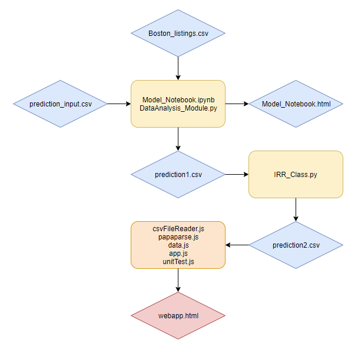

# predict_nyc_housing

---

## Introduction ##

Our project helps AirBnB landlords in Boston area breakdown the economics behind rental pricing. Landlords will just need to enter the basic information and costs about the rental unit, and they can visualize how much rental fee the unit generates so that landlords can make an economically sound decision.

## Demo ##

Here is a working live demo :  https://youtu.be/YU-VsCWHD_4

## Technique ##

 - Python - to develop data science models to predict nightly rates and to calculate calculate Internal Rate of Return (IRR)
 - jQuery - for handling user interactions with the Web App and manipulating various DOM Objects
 - Bootstrap - to assist formatting of certain html form elements
 - RequireJS - for handling graphs generated by Plotly

## Design ##

 - Data Analysis Model

The Data Analytics Model deploys machine learning models (Lasso and Random Forests Regression) to identify key drivers of daily renting prices at Boston - location, room size, and room type. Based on model results, nightly rates are predicted for various property scenarios. The estimated nightly rates provide inputs for following IRR calculation and Web App development. Data Analytics Model imports Boston Listings data from the Inside Airbnb. After feature engineering, data cleaning and model building, it finally return estimated nightly rates for various property scenarios. 

 - Internal Rate of Return (IRR) Model

The Internal Rate of Return (IRR) model helps the landlord visualize how much return they will be able to generate for their investment in the apartment. If the IRR is positive, then the landlord is making money through investing the property and renting out the room. Vice versa, the landlord is losing money. The IRR model uses user inputted data on the amenities (i.e. includes TV, included coffee machine, etc.) included with the apartment to determine a realistic monthly operating cost for the landlord. In addition, the model interact with the results generated from the Data Analytics Model to realize how much monthly income the landlord is able to generate. Therefore, we are able to reasonable assume a consistent after tax cash flow for the landlord in the coming years on a monthly basis. Using such cash flow, couple with user entered information on the apartment or house price (how much user paid for the rental unit), we are able to return how much investment return the landlord is able to generate over time and understand whether the investment for such property makes economic sense.

 - Web App

The Web App serves as a interface for users to utilize the results of our analysis. It utilizes a database produced by the Data Analytics Model and the IRR Model, which comprise entries that contain property following lookup attributes - number of bedrooms, number of bathrooms, type of listing (entire place or private room), relative location of the property (21 districts divided into six groups by their relative locations within Boston), number of amenities offered, price of property; and the following return attributes: IRR and nightly rates. The Web App takes the user inputs through a html form and look up the results based on the values of the form fields.

## Features ##

 - IRRs and Nightly Rates Calculator

By specifying the details of the user’s property including: i) location of the property (as district within Boston); ii) type of short-term rental listing (entire place or private room); iii) the number of bedrooms; iv) the number of bathrooms; v) amenities offered; vi) purchase price. Based on the above fields, the Web App will look up the data in the output from the Data Analytics Model and IRR Model that match all six attributes. The result of the lookup function will be an IRR of the investment based on the user’s inputs and a nightly rate that the property is likely to yield based on our Data Analytics Model.

 - Visualization of Data Analytics Model
 
Interactive graphical representations of our Data Analysis Model will also be displayed on the site. They include i) a map of AirBnB listings with various nightly rates plotted and ii) a district-based (the 21 districts classified into six groups) statistics of nightly rates. This helps users visualize the outcome of our Data Analytics Model. 

## Tests ##

 - Lookup Function Testing

The lookup function is the core function that identifies the matching entry in the database against user’s inputs. This test verifies whether the function is able to identify the correct entry and return the correct IRR and nightly rates.

 - Amenities Count Testing

The algorithm generalizes user’s input of amenities via check boxes. The number of amenities (instead of whether a particular piece of amenity is offered) is used as a lookup value. The amenities count function counts the checked boxes in the html form. This test verifies whether the function counts the number of amenities correctly. 

## Contributors ##

 - QIAN, Junjie (JJ) / Email: jjqians@seas.upenn.edu
 - SHEN, Meng (Phil) / Email: philshen@seas.upenn.edu
 - CHAN, Tsz Lung (Simon) / Email: simontlc@seas.upenn.edu

  [1]: https://github.com/UPenn-CIT599/final-project-magicteam/blob/master/report/Airbnb_GIF.gif
  [2]: https://github.com/UPenn-CIT599/final-project-magicteam/blob/master/report/DesignChart.png
